```mermaid
erDiagram

  users {
    bigint id PK
    varchar email
    varchar password
    varchar nickname
    varchar profile_image_url
    varchar language
    float companion_score
    int companion_review_count
    enum role
    enum status
    timestamp suspended_until
    timestamp created_at
    timestamp updated_at
    timestamp deleted_at
  }

  merchant_applications {
    bigint id PK
    bigint user_id FK
    varchar shop_name
    varchar business_number
    varchar category
    varchar address
    decimal lat
    decimal lng
    varchar phone
    text description
    enum status
    varchar reject_reason
    timestamp created_at
    timestamp updated_at
  }

  suspensions {
    bigint id PK
    bigint user_id FK
    bigint admin_id FK
    text reason
    timestamp suspended_until
    timestamp created_at
  }

  places {
    bigint id PK
    varchar name
    enum category
    text description
    varchar address
    decimal lat
    decimal lng
    varchar thumbnail_url
    json image_urls
    varchar operating_hours
    varchar closed_days
    varchar phone
    varchar admission_fee
    float rating
    int review_count
    int like_count
    int view_count
    json tags
    enum status
    timestamp created_at
    timestamp updated_at
  }

  user_likes {
    bigint id PK
    bigint user_id FK
    bigint place_id FK
    timestamp created_at
  }

  festivals {
    bigint id PK
    varchar name
    text description
    varchar region
    varchar location
    decimal lat
    decimal lng
    date start_date
    date end_date
    varchar thumbnail_url
    json image_urls
    enum status
    timestamp created_at
    timestamp updated_at
  }

  posts {
    bigint id PK
    bigint user_id FK
    bigint place_id FK
    enum post_type
    varchar title
    text content
    json image_urls
    int view_count
    int like_count
    date meeting_date
    int max_members
    int current_members
    enum status
    timestamp created_at
    timestamp updated_at
    timestamp deleted_at
  }

  comments {
    bigint id PK
    bigint user_id FK
    bigint post_id FK
    bigint parent_comment_id FK
    text content
    enum status
    timestamp created_at
    timestamp updated_at
    timestamp deleted_at
  }

  reviews {
    bigint id PK
    bigint user_id FK
    bigint place_id FK
    int rating
    text content
    json image_urls
    varchar receipt_image_url
    enum status
    timestamp created_at
    timestamp updated_at
    timestamp deleted_at
  }

  reports {
    bigint id PK
    bigint reporter_id FK
    enum target_type
    bigint target_id
    enum reason
    text description
    enum status
    varchar action_taken
    bigint resolved_by FK
    timestamp resolved_at
    timestamp created_at
  }

  chat_rooms {
    bigint id PK
    bigint post_id FK
    bigint owner_id FK
    varchar title
    text description
    int max_members
    int current_members
    enum status
    timestamp created_at
    timestamp updated_at
  }

  chat_room_members {
    bigint id PK
    bigint chat_room_id FK
    bigint user_id FK
    enum member_state
    timestamp joined_at
    timestamp left_at
  }

  join_requests {
    bigint id PK
    bigint chat_room_id FK
    bigint user_id FK
    text message
    enum status
    timestamp created_at
    timestamp updated_at
  }

  messages {
    bigint id PK
    bigint chat_room_id FK
    bigint sender_id FK
    enum message_type
    text content
    varchar file_url
    varchar file_name
    bigint file_size
    text translated_content
    varchar translate_lang
    timestamp sent_at
  }
  
  notifications {
    bigint id PK
    bigint user_id FK
    varchar type
    varchar title
    text message
    varchar reference_type
    bigint reference_id
    boolean is_read
    timestamp created_at
    timestamp deleted_at
  }

  support_rooms {
    bigint id PK
    bigint user_id FK
    bigint admin_id FK
    enum status
    timestamp created_at
    timestamp updated_at
    timestamp closed_at
  }

  support_messages {
    bigint id PK
    bigint support_room_id FK
    bigint sender_id FK
    enum sender_role
    enum message_type
    text content
    varchar file_url
    timestamp sent_at
  }

  companion_reviews {
    bigint id PK
    bigint reviewer_id FK
    bigint target_user_id FK
    bigint chat_room_id FK
    int score
    text content
    timestamp created_at
  }

  wallets {
    bigint id PK
    bigint user_id FK
    bigint balance
    timestamp created_at
    timestamp updated_at
  }

  payment_orders {
    bigint id PK
    bigint user_id FK
    varchar order_id
    varchar idempotency_key
    bigint amount
    enum payment_method
    enum status
    varchar pg_transaction_id
    timestamp created_at
    timestamp updated_at
  }

  yeopjeon_histories {
    bigint id PK
    bigint user_id FK
    bigint payment_order_id FK
    bigint shop_id FK
    enum type
    bigint amount
    bigint balance_snapshot
    text description
    timestamp created_at
  }

  refund_requests {
    bigint id PK
    bigint user_id FK
    bigint payment_order_id FK
    bigint amount
    text reason
    enum status
    varchar reject_reason
    bigint resolved_by FK
    timestamp resolved_at
    timestamp created_at
  }

  qr_pay_requests {
    bigint id PK
    varchar pay_request_id
    bigint user_id FK
    bigint shop_id FK
    bigint amount
    json menu_items
    enum status
    text reject_reason
    timestamp expired_at
    timestamp created_at
    timestamp updated_at
  }

  products {
    bigint id PK
    varchar name
    text description
    varchar category
    bigint price
    int stock
    int original_stock
    json image_urls
    int validity_days
    enum status
    timestamp created_at
    timestamp updated_at
  }

  store_orders {
    bigint id PK
    bigint user_id FK
    varchar order_id
    varchar idempotency_key
    bigint total_price
    enum status
    timestamp created_at
  }

  store_order_items {
    bigint id PK
    bigint store_order_id FK
    bigint product_id FK
    int quantity
    bigint unit_price
  }

  user_items {
    bigint id PK
    bigint user_id FK
    bigint product_id FK
    bigint store_order_id FK
    enum status
    timestamp expired_at
    timestamp used_at
    timestamp created_at
  }

  shops {
    bigint id PK
    bigint user_id FK
    bigint application_id FK
    varchar shop_name
    varchar category
    varchar address
    decimal lat
    decimal lng
    varchar phone
    text description
    json image_urls
    varchar operating_hours
    varchar closed_days
    boolean is_certified
    float rating
    int review_count
    enum status
    timestamp created_at
    timestamp updated_at
  }

  menus {
    bigint id PK
    bigint shop_id FK
    varchar name
    text description
    bigint price
    varchar image_url
    boolean is_available
    timestamp created_at
    timestamp updated_at
  }

  shop_wallets {
    bigint id PK
    bigint shop_id FK
    bigint balance
    varchar bank_name
    varchar account_number
    varchar account_holder
    timestamp created_at
    timestamp updated_at
  }

  settlement_requests {
    bigint id PK
    bigint shop_id FK
    bigint amount
    enum status
    varchar reject_reason
    timestamp completed_at
    timestamp created_at
  }

  ad_applications {
    bigint id PK
    bigint shop_id FK
    varchar ad_type
    date start_date
    date end_date
    bigint cost
    enum status
    timestamp created_at
  }

  store_certifications {
    bigint id PK
    bigint shop_id FK
    enum status
    text reject_reason
    bigint reviewed_by FK
    timestamp reviewed_at
    timestamp created_at
  }

  faq_chat_logs {
    bigint id PK
    bigint user_id FK
    text question
    text answer
    varchar answer_source
    timestamp created_at
  }

  common_error_logs {
    bigint id PK
    varchar domain
    varchar error_type
    text message
    text detail
    varchar external_provider
    timestamp created_at
  }

  faqs {
    bigint id PK
    varchar question
    text answer
    varchar category
    boolean is_active
    timestamp created_at
    timestamp updated_at
  }

  banners {
    bigint id PK
    varchar title
    varchar image_url
    varchar link_url
    enum status
    int sort_order
    timestamp start_at
    timestamp end_at
    timestamp created_at
  }

  users ||--o{ merchant_applications : "신청"
  users ||--o{ suspensions : "정지 이력"
  users ||--o| wallets : "보유"
  users ||--o{ user_likes : "찜"
  users ||--o{ posts : "작성"
  users ||--o{ comments : "작성"
  users ||--o{ reviews : "작성"
  users ||--o{ reports : "신고"
  users ||--o{ chat_room_members : "참여"
  users ||--o{ join_requests : "신청"
  users ||--o{ messages : "전송"
  users ||--o{ notifications : "수신"
  users ||--o{ support_rooms : "상담 요청"
  users ||--o{ support_messages : "상담 메시지"
  users ||--o{ companion_reviews : "작성"
  users ||--o{ payment_orders : "결제"
  users ||--o{ yeopjeon_histories : "내역"
  users ||--o{ refund_requests : "환불"
  users ||--o{ store_orders : "구매"
  users ||--o{ user_items : "보유"
  users ||--o{ faq_chat_logs : "질문"
  users ||--o| shops : "운영"

  places ||--o{ user_likes : "찜 받음"
  places ||--o{ reviews : "리뷰"
  places ||--o{ posts : "관련"

  posts ||--o{ comments : "댓글"
  posts ||--o| chat_rooms : "채팅방"

  chat_rooms ||--o{ chat_room_members : "멤버"
  chat_rooms ||--o{ join_requests : "신청"
  chat_rooms ||--o{ messages : "메시지"
  chat_rooms ||--o{ companion_reviews : "리뷰"

  support_rooms ||--o{ support_messages : "메시지"

  shops ||--o{ menus : "메뉴"
  shops ||--o| shop_wallets : "지갑"
  shops ||--o{ settlement_requests : "정산"
  shops ||--o{ ad_applications : "광고"
  shops ||--o{ store_certifications : "인증"
  shops ||--o{ qr_pay_requests : "QR 결제"

  merchant_applications ||--o| shops : "생성"

  payment_orders ||--o{ yeopjeon_histories : "이력"
  payment_orders ||--o{ refund_requests : "환불"

  store_orders ||--o{ store_order_items : "항목"
  store_orders ||--o{ user_items : "아이템"
  products ||--o{ store_order_items : "포함"
  products ||--o{ user_items : "보유"
```

# 05_ERD

> **문서 버전**: v1.0
**작성일**: 2026-05-15 (수정 예정)
**프로젝트명**: 춘배투어 (ChunBae Tour)
**작성자**: 황춘배
> 

---

## 1. 도메인별 테이블 목록

| 도메인 | 테이블 | 담당 |
| --- | --- | --- |
| 회원/인증 | users, merchant_applications | 정민교 |
| 관리자 | faqs, banners, suspensions | 정민교 |
| 관광지/지도 | places, user_likes | 김인목 |
| 검색 | (Redis 중심, DB 보조) | 김인목 |
| 축제/캘린더 | festivals | 박경화 |
| 커뮤니티 | posts, comments | 박경화 |
| 채팅/매칭 | chat_rooms, chat_room_members, join_requests, messages, notifications, companion_reviews, support_rooms, support_messages | 임하은 |
| 번역/AI | faq_chat_logs, common_error_logs | 임하은 |
| 결제/엽전 | wallets, payment_orders, yeopjeon_histories, refund_requests, qr_pay_requests | 신현민 |
| 스토어 | products, store_orders, store_order_items, user_items | 신현민 |
| 상인/가게 | shops, menus, shop_wallets, settlement_requests, ad_applications, store_certifications | 신현민 |

---

## 2. 전체 ERD (Mermaid)

> 첫 번째 러프 ERD는 제거하고, enum/json/decimal 기반 정제 ERD만 유지한다.
> 



---

## 3. 테이블 상세 설계

### 3.1 users

| 컬럼 | 타입 | 제약 | 설명 |
| --- | --- | --- | --- |
| id | BIGINT | PK, AUTO_INCREMENT | 사용자 ID |
| email | VARCHAR(255) | UNIQUE, NOT NULL | 이메일 (로그인 ID) |
| password | VARCHAR(255) | NOT NULL | BCrypt 암호화 비밀번호 |
| nickname | VARCHAR(50) | UNIQUE, NOT NULL | 닉네임 |
| profile_image_url | VARCHAR(500) | NULL | 프로필 이미지 S3 URL |
| language | VARCHAR(10) | NOT NULL, DEFAULT ‘ko’ | 사용자 언어 설정 (ko, en, ja, zh 등) |
| companion_score | FLOAT | DEFAULT 0 | 동행 평균 점수 |
| companion_review_count | INT | DEFAULT 0 | 동행 리뷰 수 |
| role | ENUM | NOT NULL | USER / MERCHANT / ADMIN |
| status | ENUM | NOT NULL, DEFAULT ACTIVE | 계정 상태 |
| suspended_until | TIMESTAMP | NULL | 정지 해제 일시 |
| created_at | TIMESTAMP | NOT NULL | 가입일 |
| updated_at | TIMESTAMP | NOT NULL | 수정일 |
| deleted_at | TIMESTAMP | NULL | 탈퇴일 (Soft Delete) |

**인덱스**

```sql
INDEX idx_users_email (email)
INDEX idx_users_nickname (nickname)
INDEX idx_users_status (status)
```

---

### 3.2 places

| 컬럼 | 타입 | 제약 | 설명 |
| --- | --- | --- | --- |
| id | BIGINT | PK | 장소 ID |
| name | VARCHAR(100) | NOT NULL | 장소명 |
| category | ENUM | NOT NULL | TOURIST_SPOT / TRADITIONAL_MARKET |
| description | TEXT | NULL | 소개 |
| address | VARCHAR(255) | NOT NULL | 주소 |
| lat | DECIMAL(10,7) | NOT NULL | 위도 |
| lng | DECIMAL(10,7) | NOT NULL | 경도 |
| thumbnail_url | VARCHAR(500) | NULL | 대표 이미지 |
| image_urls | JSON | NULL | 이미지 URL 배열 |
| operating_hours | VARCHAR(100) | NULL | 운영시간 |
| closed_days | VARCHAR(100) | NULL | 휴무일 |
| phone | VARCHAR(20) | NULL | 전화번호 |
| admission_fee | VARCHAR(50) | NULL | 입장료 정보 |
| rating | FLOAT | DEFAULT 0 | 평균 별점 |
| review_count | INT | DEFAULT 0 | 리뷰 수 |
| like_count | INT | DEFAULT 0 | 찜 수 |
| view_count | INT | DEFAULT 0 | 조회수 |
| tags | JSON | NULL | 태그 배열 |
| status | ENUM | NOT NULL, DEFAULT ACTIVE | ACTIVE / HIDDEN / DELETED |
| created_at | TIMESTAMP | NOT NULL | 등록일 |
| updated_at | TIMESTAMP | NOT NULL | 수정일 |

**인덱스**

```sql
INDEX idx_places_category (category)
INDEX idx_places_status (status)
INDEX idx_places_lat_lng (lat, lng)  -- 위치 기반 쿼리
FULLTEXT INDEX idx_places_name (name)  -- 키워드 검색
```

---

### 3.3 wallets

| 컬럼 | 타입 | 제약 | 설명 |
| --- | --- | --- | --- |
| id | BIGINT | PK | 지갑 ID |
| user_id | BIGINT | FK, UNIQUE | 사용자 ID (1:1) |
| balance | BIGINT | NOT NULL, DEFAULT 0 | 엽전 잔액 |
| created_at | TIMESTAMP | NOT NULL | 생성일 |
| updated_at | TIMESTAMP | NOT NULL | 수정일 |

> ⚠️ **balance는 절대 음수가 되면 안 됨** → CHECK(balance >= 0) 제약 추가 권장
동시성 제어는 분산 락 + 비관적 락으로 보호 (동시성 제어 설계서 참조)
> 

---

### 3.4 chat_rooms

| 컬럼 | 타입 | 제약 | 설명 |
| --- | --- | --- | --- |
| id | BIGINT | PK | 채팅방 ID |
| post_id | BIGINT | FK | 연결된 동행 게시글 |
| owner_id | BIGINT | FK | 방장 userId |
| title | VARCHAR(50) | NOT NULL | 채팅방 제목 |
| description | TEXT | NULL | 채팅방 소개 |
| max_members | INT | NOT NULL | 최대 인원 (2~50) |
| current_members | INT | NOT NULL, DEFAULT 1 | 현재 인원 |
| status | ENUM | NOT NULL, DEFAULT OPEN | OPEN / FULL / CLOSED |
| created_at | TIMESTAMP | NOT NULL | 생성일 |
| updated_at | TIMESTAMP | NOT NULL | 수정일 |

**인덱스**

```sql
INDEX idx_chat_rooms_status (status)
INDEX idx_chat_rooms_owner (owner_id)
```

---

### 3.5 messages

| 컬럼 | 타입 | 제약 | 설명 |
| --- | --- | --- | --- |
| id | BIGINT | PK | 메시지 ID |
| chat_room_id | BIGINT | FK | 채팅방 ID |
| sender_id | BIGINT | FK | 발신자 userId |
| message_type | ENUM | NOT NULL | TEXT / IMAGE / FILE / SYSTEM |
| content | TEXT | NULL | 텍스트 메시지 내용 또는 파일/이미지 캡션 |
| file_url | VARCHAR(500) | NULL | IMAGE/FILE 메시지의 S3 URL |
| file_name | VARCHAR(255) | NULL | 원본 파일명 |
| file_size | BIGINT | NULL | 파일 크기(byte) |
| translated_content | TEXT | NULL | 번역된 메시지 |
| translate_lang | VARCHAR(10) | NULL | 번역 대상 언어 |
| sent_at | TIMESTAMP | NOT NULL | 전송 시각 |

**인덱스**

```sql
INDEX idx_messages_chat_room (chat_room_id, sent_at DESC)  -- 메시지 목록 조회
```

> ⚠️ 메시지는 대용량 데이터로 증가하므로, 향후 파티셔닝 또는 NoSQL(MongoDB) 이관 검토 권장
> 

---

### 3.6 payment_orders

| 컬럼 | 타입 | 제약 | 설명 |
| --- | --- | --- | --- |
| id | BIGINT | PK | 결제 ID |
| user_id | BIGINT | FK | 사용자 ID |
| order_id | VARCHAR(100) | UNIQUE | 주문 번호 |
| idempotency_key | VARCHAR(100) | UNIQUE | 멱등성 키 |
| amount | BIGINT | NOT NULL | 결제 금액 (원) |
| payment_method | ENUM | NOT NULL | CARD / KAKAO_PAY / NAVER_PAY |
| status | ENUM | NOT NULL | PENDING / COMPLETED / FAILED / CANCELLED |
| pg_transaction_id | VARCHAR(100) | NULL | PG사 트랜잭션 ID |
| created_at | TIMESTAMP | NOT NULL | 요청일 |
| updated_at | TIMESTAMP | NOT NULL | 수정일 |

**인덱스**

```sql
UNIQUE INDEX idx_payment_idempotency (idempotency_key)  -- 중복 결제 방지
INDEX idx_payment_user (user_id, created_at DESC)
```

---

### 3.7 products

| 컬럼 | 타입 | 제약 | 설명 |
| --- | --- | --- | --- |
| id | BIGINT | PK | 상품 ID |
| name | VARCHAR(100) | NOT NULL | 상품명 |
| description | TEXT | NULL | 상품 설명 |
| category | VARCHAR(50) | NOT NULL | 상품 카테고리 |
| price | BIGINT | NOT NULL | 가격 (엽전) |
| stock | INT | NOT NULL | 현재 재고 |
| original_stock | INT | NOT NULL | 초기 재고 |
| image_urls | JSON | NULL | 이미지 URL 배열 |
| validity_days | INT | NULL | 유효기간 (일) |
| status | ENUM | NOT NULL | ON_SALE / SOLD_OUT / HIDDEN |
| created_at | TIMESTAMP | NOT NULL | 등록일 |
| updated_at | TIMESTAMP | NOT NULL | 수정일 |

> ⚠️ **stock은 절대 음수가 되면 안 됨** → CHECK(stock >= 0) 제약 추가 권장
동시성 제어는 Redis 가점유 + 분산 락 + 비관적 락으로 보호
> 

---

### 3.8 shops

| 컬럼 | 타입 | 제약 | 설명 |
| --- | --- | --- | --- |
| id | BIGINT | PK | 가게 ID |
| user_id | BIGINT | FK, UNIQUE | 상인 userId (1:1) |
| application_id | BIGINT | FK | 승인된 신청 ID |
| shop_name | VARCHAR(50) | NOT NULL | 가게명 |
| category | VARCHAR(50) | NOT NULL | 음식/잡화 등 |
| address | VARCHAR(255) | NOT NULL | 주소 |
| lat | DECIMAL(10,7) | NOT NULL | 위도 |
| lng | DECIMAL(10,7) | NOT NULL | 경도 |
| phone | VARCHAR(20) | NULL | 전화번호 |
| description | TEXT | NULL | 가게 소개 |
| image_urls | JSON | NULL | 이미지 URL 배열 |
| operating_hours | VARCHAR(100) | NULL | 운영시간 |
| closed_days | VARCHAR(100) | NULL | 휴무일 |
| is_certified | BOOLEAN | NOT NULL, DEFAULT FALSE | 인증 마크 여부 |
| rating | FLOAT | DEFAULT 0 | 평균 별점 |
| review_count | INT | DEFAULT 0 | 리뷰 수 |
| status | ENUM | NOT NULL | ACTIVE / SUSPENDED / CLOSED |
| created_at | TIMESTAMP | NOT NULL | 등록일 |
| updated_at | TIMESTAMP | NOT NULL | 수정일 |

### 3.9 posts

| 컬럼명 | 데이터 타입 | 제약 조건 | 설명 |
| --- | --- | --- | --- |
| id | BIGINT | PK, NOT NULL | 게시글 고유 식별자 |
| user_id | BIGINT | FK, NOT NULL | 작성자 고유 ID |
| place_id | BIGINT | FK, NULL | 관련 장소 고유 ID |
| post_type | ENUM | NOT NULL | 게시글 유형 (동행 구하기, 자유글)('COMPANION', 'FREE') |
| title | VARCHAR(255) | NOT NULL | 게시글 제목 |
| content | TEXT | NOT NULL | 게시글 본문 내용 |
| image_urls | JSON | NULL | 첨부 이미지 URL 배열 |
| view_count | INT | NOT NULL, DEFAULT 0 | 조회수 |
| like_count | INT | NOT NULL, DEFAULT 0 | 좋아요 수 |
| meeting_date | DATE | NULL | 동행 희망 날짜 |
| max_members | INT | NULL | 최대 모집 인원 수 |
| current_members | INT | NULL | 현재 참여 인원 수 |
| status | ENUM('ACTIVE', 'BLOCKED', 'DELETED') | NOT NULL | 게시글 상태 (활성, 차단, 삭제) |
| created_at | TIMESTAMP | NOT NULL | 등록 일시 |
| updated_at | TIMESTAMP | NOT NULL | 수정 일시 |
| deleted_at | TIMESTAMP | NULL | 삭제 일시 (소프트 딜리트용) |

### 3.9 comments

| 컬럼명 | 데이터 타입 | 제약 조건 | 설명 |
| --- | --- | --- | --- |
| id | BIGINT | PK, NOT NULL | 댓글 고유 식별자 |
| user_id | BIGINT | FK, NOT NULL | 댓글 작성자 고유 ID |
| post_id | BIGINT | FK, NOT NULL | 대상 게시글 고유 ID |
| parent_comment_id | BIGINT | FK, NULL | 부모 댓글 ID (대댓글인 경우 필수, 일반 댓글은 NULL) |
| content | TEXT | NOT NULL | 댓글 내용 |
| status | ENUM('ACTIVE', 'BLOCKED', 'DELETED') | NOT NULL | 댓글 상태 (활성, 차단, 삭제) |
| created_at | TIMESTAMP | NOT NULL | 등록 일시 |
| updated_at | TIMESTAMP | NOT NULL | 수정 일시 |
| deleted_at | TIMESTAMP | NULL | 삭제 일시 (소프트 딜리트용) |

### 3.10 festivals

| 컬럼명 | 데이터 타입 | 제약 조건 | 설명 |
| --- | --- | --- | --- |
| id | BIGINT | PK, NOT NULL | 축제 고유 식별자 |
| name | VARCHAR(255) | NOT NULL | 축제 이름 |
| description | TEXT | NULL | 축제 상세 설명 |
| region | VARCHAR(100) | NOT NULL | 축제 개최 지역 (행정 구역 단위) |
| location | VARCHAR(255) | NOT NULL | 축제 개최 상세 장소 (주소 등) |
| lat | DECIMAL(10,7) | NOT NULL | 장소 위도 (Latitude) |
| lng | DECIMAL(11,7) | NOT NULL | 장소 경도 (Longitude) |
| start_date | DATE | NOT NULL | 축제 시작일 |
| end_date | DATE | NOT NULL | 축제 종료일 |
| thumbnail_url | VARCHAR(512) | NULL | 대표 썸네일 이미지 URL |
| image_urls | JSON | NULL | 축제 관련 추가 이미지 URL 배열 |
| status | ENUM('ACTIVE', 'HIDDEN', 'DELETED') | NOT NULL | 축제 상태 (노출, 숨김, 삭제) |
| created_at | TIMESTAMP | NOT NULL | 등록 일시 |
| updated_at | TIMESTAMP | NOT NULL | 수정 일시 |

---

## 4. Redis 데이터 구조 정의

> MySQL ERD와 별도로 Redis에서 관리하는 데이터 구조를 정의한다.
> 

| Key 패턴 | 자료구조 | TTL | 용도 |
| --- | --- | --- | --- |
| `refresh:{userId}` | String | 7일 | Refresh Token 저장 |
| `blacklist:{token}` | String | 토큰 잔여 만료시간 | 로그아웃 토큰 블랙리스트 |
| `geo:places` | Geospatial | 없음 | 관광지 위치 인덱스 |
| `place:{placeId}` | String (JSON) | 10분 | 관광지 상세 캐시 |
| `place:view:{placeId}` | String (INCR) | 없음 | 관광지 조회수 |
| `place:like:{placeId}` | String (INCR) | 없음 | 관광지 찜 수 |
| `stock:{productId}` | String (DECR) | 10분 | 상품 재고 가점유 |
| `search:ranking` | ZSet | 없음 (일간 초기화) | 인기 검색어 |
| `search:ranking:prev` | ZSet | 없음 | 이전 인기 검색어 (순위 변동 계산) |
| `search:recent:{userId}` | List | 30일 | 사용자 최근 검색어 |
| `recommend:popular` | ZSet | 1시간 | 인기 관광지 랭킹 |
| `purchase:lock:{userId}` | String (Redisson) | 5초 | 상품 구매 분산 락 |
| `payment:lock:{userId}` | String (Redisson) | 5초 | 엽전 결제 분산 락 |
| `chatroom:lock:{chatRoomId}` | String (Redisson) | 5초 | 채팅방 참여 분산 락 |
| `chat:{chatRoomId}` | Pub/Sub | - | 채팅 메시지 브로커 |
| `notification:{userId}` | Pub/Sub | - | 사용자 알림 브로커 |
| `post:liked:{postId}:{userId}` | String (SETNX) | 없음 | 게시글 좋아요 중복 방지 |
| `post:like:{postId}` | String (INCR) | 없음 | 게시글 좋아요 수 |

---

## 5. 주요 설계 결정 사항

### 5.1 Soft Delete 전략

삭제 시 실제 DELETE 대신 `deleted_at` 컬럼 설정.
적용 테이블: `users`, `posts`, `comments`, `reviews`

- `posts.status = BLOCKED`: 신고 처리로 사용자 화면에서 숨김 처리된 게시글
- `posts.status = DELETED`: 작성자 삭제 또는 관리자 삭제로 비공개 처리된 게시글

**이유**
- 신고 처리 시 삭제된 게시글 원문 조회 필요
- 사용자 탈퇴 후 결제 내역 보존 필요 (법적 의무)
- QueryDSL에서 `deleted_at IS NULL` 조건으로 자동 필터링

---

### 5.2 JSON 컬럼 사용 기준

`image_urls`, `tags`, `menu_items` 등 리스트형 데이터는 JSON 컬럼으로 저장.

**이유**
- 1:N 테이블 생성 시 JOIN 비용 발생
- 이미지 URL, 태그는 단순 조회만 사용하므로 JSON으로 충분
- MySQL 8.4 JSON 컬럼 지원 및 JSON_CONTAINS 등 함수 활용 가능

---

### 5.3 balance BIGINT 선택 이유

- INT(최대 약 21억)는 엽전 잔액 충분하나, 서비스 확장 시 안전을 위해 BIGINT 사용

---

### 5.4 메시지 테이블 확장 고려

현재 MySQL messages 테이블에 저장하되, 트래픽 증가 시 MongoDB 또는 Cassandra 이관 고려.
`sent_at DESC` 파티셔닝으로 조회 성능 최적화 예정.

---

### 5.5 companion_reviews 복합 UNIQUE 제약

동일 채팅방 내에서 같은 사람에게 중복 리뷰를 작성하는 것을 DB 레벨에서 방지한다.

```sql
UNIQUE KEY uq_companion_review (reviewer_id, target_user_id, chat_room_id)
```

**이유**
- 애플리케이션 레벨 검사만으로는 동시 요청 시 중복 삽입이 발생할 수 있음
- DB UNIQUE 제약으로 최종 정합성 보장

---

### 5.6 merchant_applications.shop_name 길이 제한

`merchant_applications.shop_name`은 최대 **50자**로 제한한다.

**이유**
- 승인 후 `shops.shop_name`(VARCHAR 50)으로 복사되므로 신청 단계부터 동일한 길이 제한 적용
- 에러코드 `SHOP_006` (“가게명은 최대 50자까지 입력 가능합니다.”)와 일치

---

*본 문서는 SA 설계 과정에서 지속적으로 업데이트됩니다.*