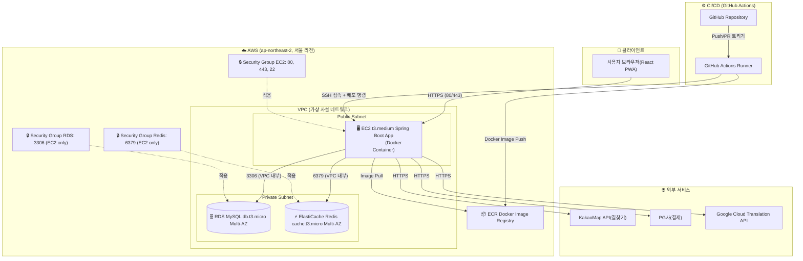
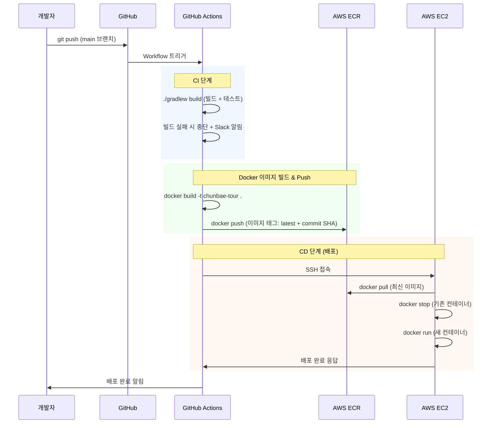
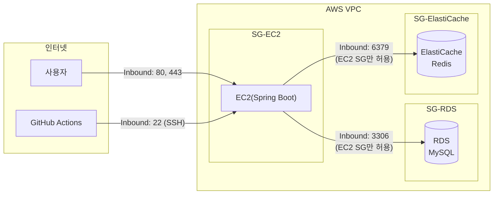
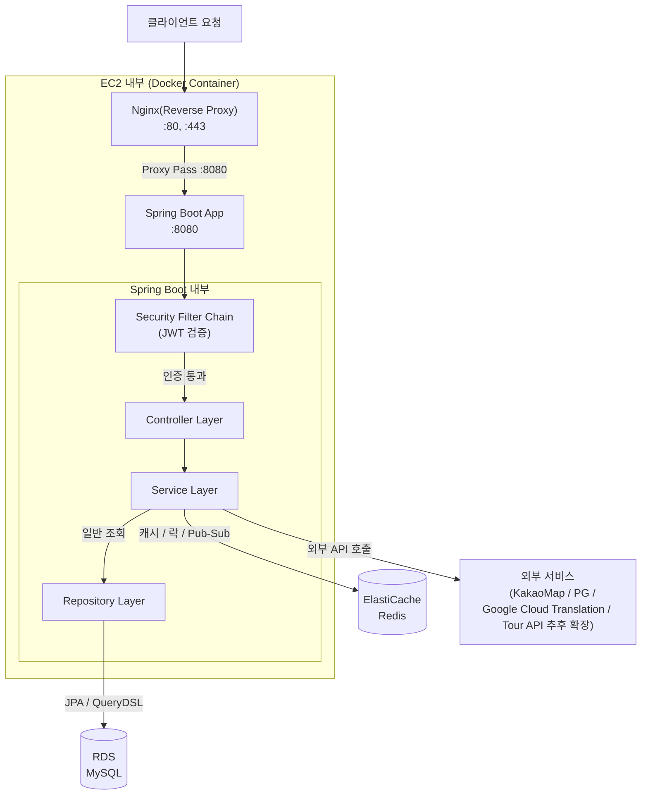
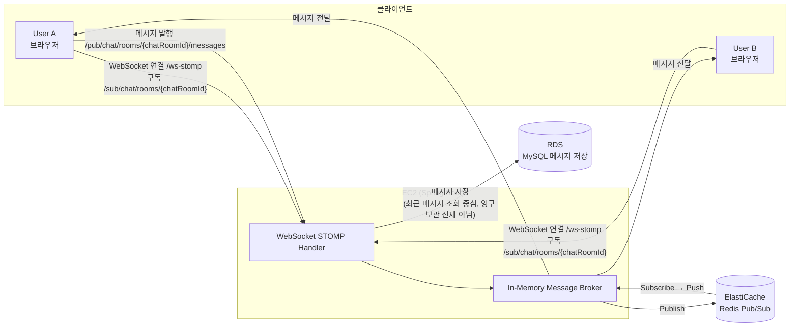

# 08_인프라_아키텍처_다이어그램

> **문서 버전**: v1.0
**작성일**: 2026-05-15
**프로젝트명**: 춘배투어 (ChunBae Tour)
**작성자**: 황춘배
> 

---

## 1. 전체 인프라 구성 개요

| 구성 요소 | 서비스 | 사양 | 역할 |
| --- | --- | --- | --- |
| **애플리케이션 서버** | AWS EC2 | t3.medium | Spring Boot 앱 실행 (Docker) |
| **데이터베이스** | AWS RDS MySQL | db.t3.micro | 메인 데이터 저장소 (AWS RDS 접근 포트: 3306) |
| **캐시 / 메시징** | AWS ElastiCache Redis | cache.t3.micro | 캐시, 분산 락, Pub/Sub, Geospatial |
| **컨테이너 레지스트리** | AWS ECR | - | Docker 이미지 저장소 |
| **CI/CD** | GitHub Actions | - | 빌드 → ECR Push → EC2 배포 |
| **프론트엔드** | React PWA | - | 바이브코딩 (정적 파일 서빙 or S3) |
| **외부 연동** | KakaoMap API / PG사 / Google Cloud Translation API / Tour API(추후 확장) | - | 외부 서비스 연동 |

---

## 2. 전체 인프라 아키텍처 다이어그램



---

## 3. CI/CD 파이프라인 상세



---

## 4. 네트워크 보안 구성 (Security Group)



### Security Group 규칙 상세

**SG-EC2 (애플리케이션 서버)**

| 방향 | 프로토콜 | 포트 | 소스 | 설명 |
| --- | --- | --- | --- | --- |
| Inbound | TCP | 80 | 0.0.0.0/0 | HTTP |
| Inbound | TCP | 443 | 0.0.0.0/0 | HTTPS |
| Inbound | TCP | 22 | GitHub Actions IP | SSH 배포 |
| Outbound | ALL | ALL | 0.0.0.0/0 | 외부 API 호출 |

**SG-RDS (데이터베이스)**

| 방향 | 프로토콜 | 포트 | 소스 | 설명 |
| --- | --- | --- | --- | --- |
| Inbound | TCP | 3306 | SG-EC2 | EC2에서만 접근 허용 |

**SG-ElastiCache (Redis)**

| 방향 | 프로토콜 | 포트 | 소스 | 설명 |
| --- | --- | --- | --- | --- |
| Inbound | TCP | 6379 | SG-EC2 | EC2에서만 접근 허용 |

---

## 5. 애플리케이션 내부 요청 처리 흐름



---

## 6. WebSocket 실시간 채팅 흐름



> 고객센터 실시간 상담 채팅도 동일한 WebSocket/STOMP 인프라를 사용하되, STOMP 경로는 `/pub/support/rooms/{supportRoomId}/messages`, `/sub/support/rooms/{supportRoomId}`로 분리한다.
> 

> **💡 Redis Pub/Sub을 쓰는 이유**
서버가 여러 대로 확장될 경우, 서버 A에 연결된 User A가 보낸 메시지를
서버 B에 연결된 User B도 받을 수 있도록 Redis가 브로커 역할을 한다.
현재는 단일 EC2이지만, 확장 가능한 구조로 미리 설계한다.
> 

---

## 7. 환경 분리 전략

> AWS RDS 접근 포트는 3306으로 통일한다. 로컬 개발 환경에서만 Docker 포트 매핑을 `3308:3306`으로 사용한다.
> 

| 환경 | 브랜치 | 배포 대상 | DB |
| --- | --- | --- | --- |
| **개발(local)** | feature/* | 로컬 Docker Compose | 로컬 MySQL |
| **운영(prod)** | main | AWS EC2 | AWS RDS |

### Docker Compose (로컬 개발 환경)

```yaml
# docker-compose.yml (로컬 개발용)
version:'3.8'
services:
	app:
	build: .
	ports:
-"8080:8080"
environment:
- SPRING_PROFILES_ACTIVE=local
depends_on:
- mysql
- redis

mysql:
image: mysql:8.0
environment:
MYSQL_ROOT_PASSWORD: root
MYSQL_DATABASE: chunbae_tour
ports:
-"3308:3306"  # 로컬 개발 환경에서만 호스트 3308 → 컨테이너 3306 매핑

redis:
image: redis:7.0
ports:
-"6379:6379"
```

---

## 8. 인프라 비용 추정 (월 기준)

| 서비스 | 사양 | 예상 비용 |
| --- | --- | --- |
| EC2 t3.medium | 2vCPU, 4GB RAM | ~$30/월 |
| RDS db.t3.micro | 1vCPU, 1GB RAM | ~$15/월 |
| ElastiCache cache.t3.micro | 1vCPU, 0.5GB RAM | ~$12/월 |
| ECR | 500MB 스토리지 | ~$0.05/월 |
| **합계** |  | **~$57/월** |

> ⚠️ AWS 교육 계정 크레딧 사용 시 비용 부담 없음.
개발 기간 외 미사용 시 EC2 인스턴스 중지 권장 (RDS, ElastiCache는 중지해도 비용 발생).
> 

---

*본 문서는 SA 설계 과정에서 지속적으로 업데이트됩니다.*