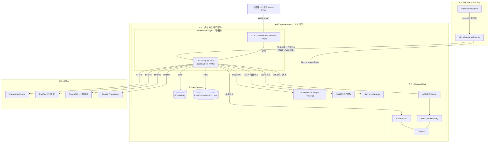
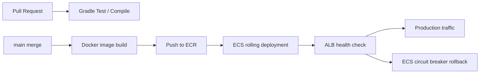
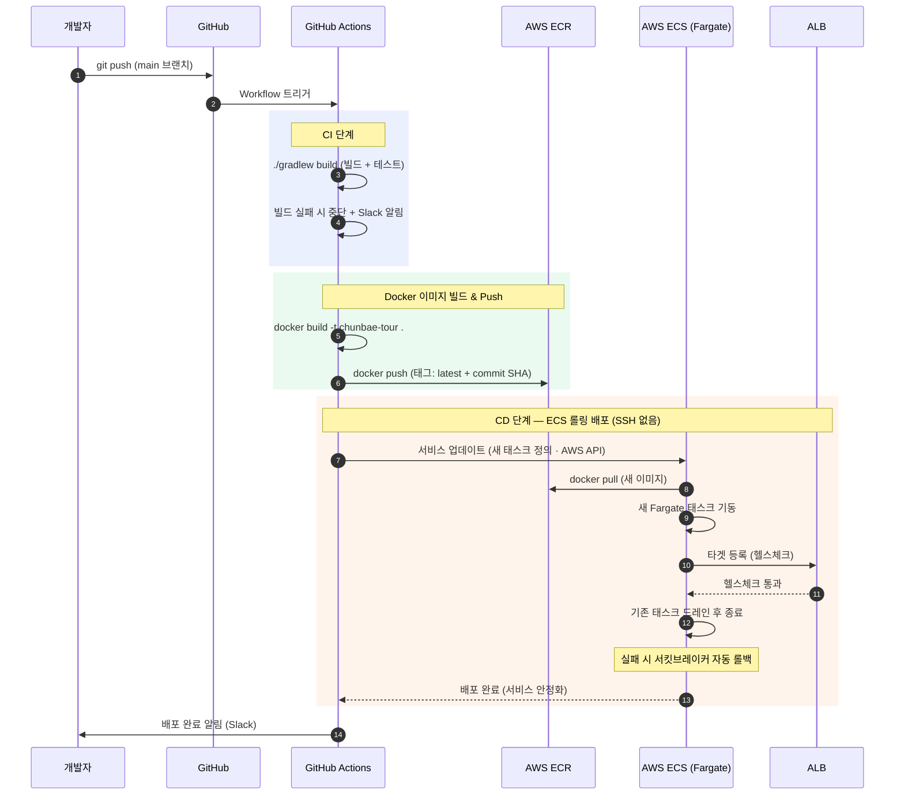
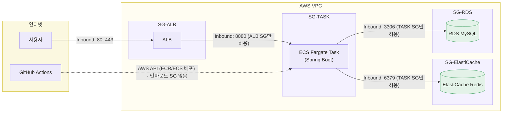
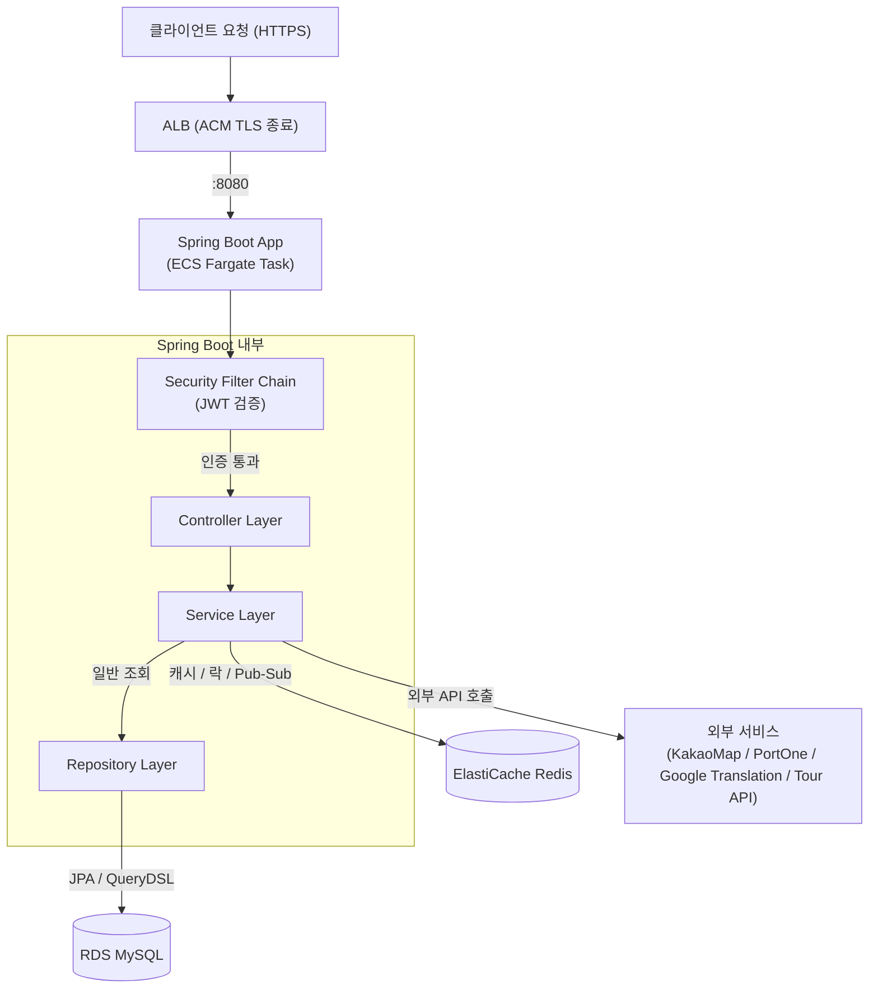
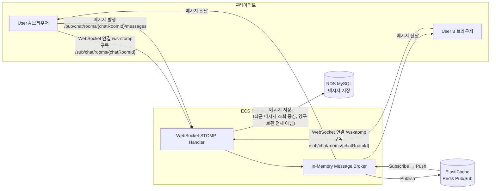

# 07_인프라_아키텍처_다이어그램

<!-- latest-update-2026-06 -->

> **문서 버전**: v3.0
> **최신 반영일**: 2026-06-22
> **최종 운영 구조**: GitHub Actions → ECR → ECS Fargate → ALB → RDS / ElastiCache / S3
> **프로젝트명**: 춘배투어 (ChunBae Tour)
> **작성자**: 황춘배

초기 설계는 EC2 Docker 배포 기반이었으나, 최종 운영 구조는 **ECS Fargate**로 전환되었다. 본 문서는 전환 후 최신 구조를 기준으로 한다.

---

## 1. 전체 인프라 구성 개요

| 구성 요소 | 서비스 | 사양 | 역할 |
| --- | --- | --- | --- |
| **컨테이너 실행** | AWS ECS Fargate | 1 vCPU / 2GB (튜닝) | Spring Boot 컨테이너 실행 (서버리스, 서버 직접 관리 제거) |
| **로드 밸런서** | AWS ALB | - | HTTPS 수신, ACM TLS 종료, target health 기반 라우팅 |
| **데이터베이스** | AWS RDS MySQL | db.t3.micro | 메인 데이터 저장소 (포트 3306), Flyway migration 대상 |
| **캐시 / 메시징** | AWS ElastiCache Redis | cache.t3.micro | 캐시, 랭킹, 최근 검색어, Geo, Pub/Sub, 분산 락, write-behind |
| **컨테이너 레지스트리** | AWS ECR | - | 백엔드 Docker 이미지 저장소 |
| **객체 스토리지** | AWS S3 | - | 프로필/게시글/채팅/CS/가게 이미지 및 첨부 저장 |
| **시크릿 관리** | AWS Secrets Manager | - | DB, Redis, OAuth, JWT, 외부 API secret |
| **CI/CD** | GitHub Actions | - | 테스트 게이트 → Docker 빌드 → ECR Push → ECS 롤링 배포 |
| **모니터링** | CloudWatch + ADOT/AMP + Grafana | - | 로그, 메트릭 수집, 대시보드, 배포 장애 추적 |
| **프론트엔드** | React PWA | - | 정적 파일 서빙 (S3 등) |
| **외부 연동** | KakaoMap·Local / PortOne V2(결제) / Google Translation / Tour API(공공데이터포털) | - | 외부 서비스 연동 |

---

## 2. 전체 인프라 아키텍처 다이어그램



### Redis Cluster 운영 메모

ElastiCache Redis는 Cluster Mode Enabled 기준이다. 따라서 `RENAME`, `MGET` 같은 multi-key 명령은 같은 hash slot의 key에서만 안전하다. 인기 검색어 스냅샷/오타 교정/추천 캐시는 hash tag로 key slot을 맞추고, 관광지 통계처럼 key 수가 많은 경우에는 hot slot을 만들지 않도록 개별 GET/pipeline 전략을 사용한다.

---

## 3. CI/CD 파이프라인

### 배포 흐름 (개요)



### 파이프라인 상세 (시퀀스)



| 구성 요소 | 최종 역할 |
| --- | --- |
| GitHub Actions | 테스트 게이트, Docker 이미지 빌드, ECR push, ECS 배포 자동화 |
| ECR | 백엔드 Docker 이미지 저장소 |
| ECS Fargate | Spring Boot 컨테이너 실행, 서버 직접 관리 제거 |
| ALB | HTTPS 트래픽 수신, target health 기반 라우팅 |
| RDS MySQL | 영속 데이터 저장, Flyway migration 대상 |
| ElastiCache Redis | 캐시, 랭킹, 최근 검색어, Geo, Pub/Sub, 분산 락, write-behind |
| S3 | 프로필/게시글/채팅/CS/가게 이미지 및 첨부 저장 |
| Secrets Manager | DB, Redis, OAuth, JWT, 외부 API secret 관리 |
| CloudWatch | 애플리케이션 로그, 배포 장애 추적 |
| Actuator/Micrometer/ADOT | health check와 metric 수집 |

---

## 4. 네트워크 보안 구성 (Security Group)



### Security Group 규칙 상세

**SG-ALB (로드 밸런서)**
| 방향 | 프로토콜 | 포트 | 소스 | 설명 |
| --- | --- | --- | --- | --- |
| Inbound | TCP | 80 | 0.0.0.0/0 | HTTP (→ 443 리다이렉트) |
| Inbound | TCP | 443 | 0.0.0.0/0 | HTTPS (ACM TLS 종료) |
| Outbound | TCP | 8080·9090 | SG-TASK | 태스크로 전달 |

**SG-TASK (ECS Fargate 태스크)**
| 방향 | 프로토콜 | 포트 | 소스 | 설명 |
| --- | --- | --- | --- | --- |
| Inbound | TCP | 8080 | SG-ALB | 앱 트래픽 (ALB만 허용) |
| Inbound | TCP | 9090 | SG-ALB | 메트릭 수집 |
| Outbound | ALL | ALL | 0.0.0.0/0 | 외부 API·ECR (IGW 경유, NAT 미사용) |

**SG-RDS (데이터베이스)**
| 방향 | 프로토콜 | 포트 | 소스 | 설명 |
| --- | --- | --- | --- | --- |
| Inbound | TCP | 3306 | SG-TASK | ECS 태스크에서만 접근 허용 |

**SG-ElastiCache (Redis)**
| 방향 | 프로토콜 | 포트 | 소스 | 설명 |
| --- | --- | --- | --- | --- |
| Inbound | TCP | 6379 | SG-TASK | ECS 태스크에서만 접근 허용 |

> **EC2 → ECS 보안 변화**: 기존 SG-EC2(80/443/22)가 **SG-ALB(80/443) + SG-TASK(8080)** 로 분리되었고, **SSH(22) 인바운드가 제거**되었다. GitHub Actions는 SSH 대신 AWS API로 배포하므로 인바운드 SG 규칙이 필요 없다 → 공격면 축소.

---

## 5. 애플리케이션 내부 요청 처리 흐름



> 기존 EC2 구조의 Nginx Reverse Proxy는 ALB로 대체되었다. TLS 종료와 라우팅은 ALB가 담당하므로 컨테이너 내부에 Nginx가 없다.

---

## 6. WebSocket 실시간 채팅 흐름



> 고객센터 실시간 상담 채팅도 동일한 WebSocket/STOMP 인프라를 사용하되, STOMP 경로는 `/pub/support/rooms/{supportRoomId}/messages`, `/sub/support/rooms/{supportRoomId}`로 분리한다.

> **💡 Redis Pub/Sub을 쓰는 이유**
> 서버(태스크)가 여러 개로 확장될 경우, 태스크 A에 연결된 User A가 보낸 메시지를 태스크 B에 연결된 User B도 받을 수 있도록 Redis가 브로커 역할을 한다. ECS Fargate는 오토스케일로 태스크가 늘 수 있으므로, 이 구조가 더욱 중요해진다.

---

## 7. 환경 분리 전략

> AWS RDS 접근 포트는 3306으로 통일한다. 로컬 개발 환경에서만 Docker 포트 매핑을 `3308:3306`으로 사용한다.

| 환경 | 브랜치 | 배포 대상 | DB |
| --- | --- | --- | --- |
| **개발(local)** | feature/* | 로컬 Docker Compose | 로컬 MySQL |
| **운영(prod)** | main | AWS ECS Fargate | AWS RDS |

### Docker Compose (로컬 개발 환경)

```yaml
# docker-compose.yml (로컬 개발용)
version: '3.8'
services:
  app:
    build: .
    ports:
      - "8080:8080"
    environment:
      - SPRING_PROFILES_ACTIVE=local
    depends_on:
      - mysql
      - redis
  mysql:
    image: mysql:8.0
    environment:
      MYSQL_ROOT_PASSWORD: root
      MYSQL_DATABASE: chunbae_tour
    ports:
      - "3308:3306"   # 로컬: 호스트 3308 → 컨테이너 3306
  redis:
    image: redis:7.0
    ports:
      - "6379:6379"
```

---

## 8. 인프라 비용 추정 (월 기준)

| 서비스 | 사양 | 예상 비용 |
| --- | --- | --- |
| ECS Fargate | 1 vCPU / 2GB, 1-2 태스크 | 약 $35-50/월 |
| ALB | - | 약 $16-20/월 |
| RDS db.t3.micro | 1vCPU, 1GB RAM | 약 $15/월 |
| ElastiCache cache.t3.micro | 1vCPU, 0.5GB RAM | 약 $12/월 |
| ECR | 500MB 스토리지 | 약 $0.05/월 |
| S3 | 소량 | 약 $1/월 |
| **합계** |  | **약 $80-100/월** |

> **비용 메모**: Fargate의 컴퓨팅 단가는 EC2보다 비쌀 수 있으나, ① 서버 관리 제거로 운영 비용 절감, ② **NAT Gateway 회피**(퍼블릭 서브넷 + ALB 전용 SG)로 네트워크 비용 절감으로 상쇄된다.
> ⚠️ AWS 교육 계정 크레딧 사용 시 비용 부담 없음. **단, 크레딧은 소진·만료되므로** 만료일 확인 필요. 미사용 시 ECS 서비스 desired count를 0으로 두면 컴퓨팅 비용을 줄일 수 있다(RDS·ElastiCache는 중지해도 비용 발생).

---

*본 문서는 SA 설계 과정에서 지속적으로 업데이트됩니다.*
