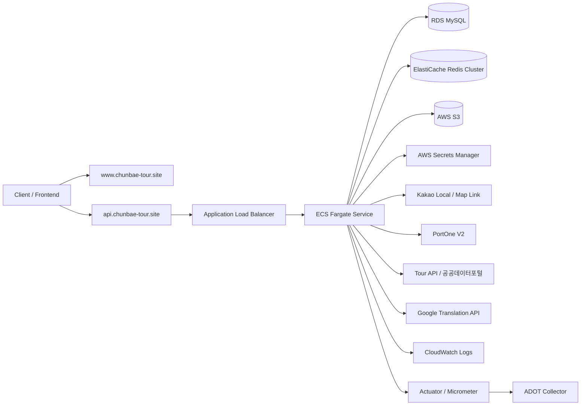
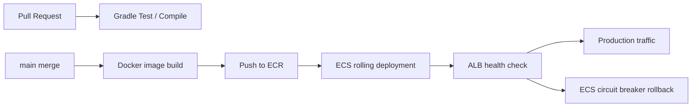
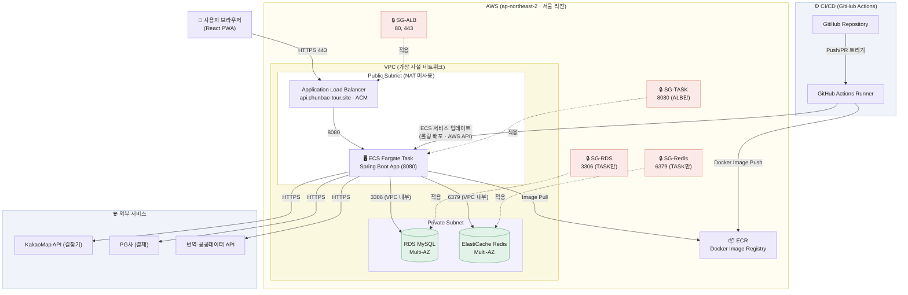
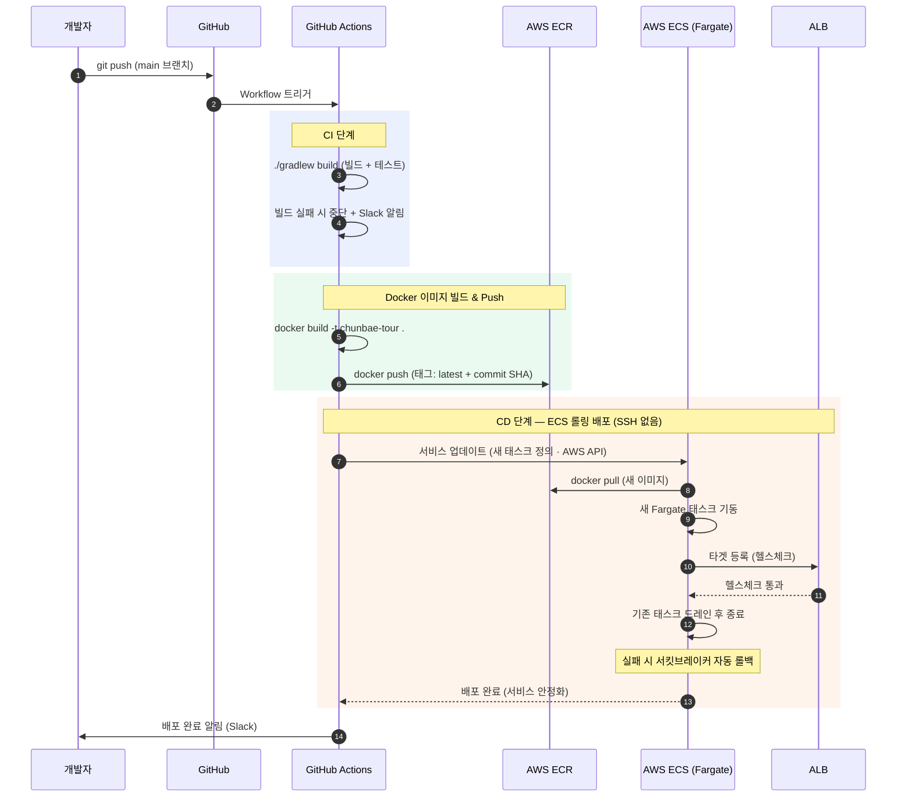
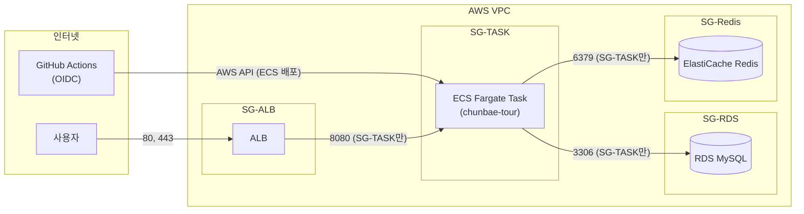
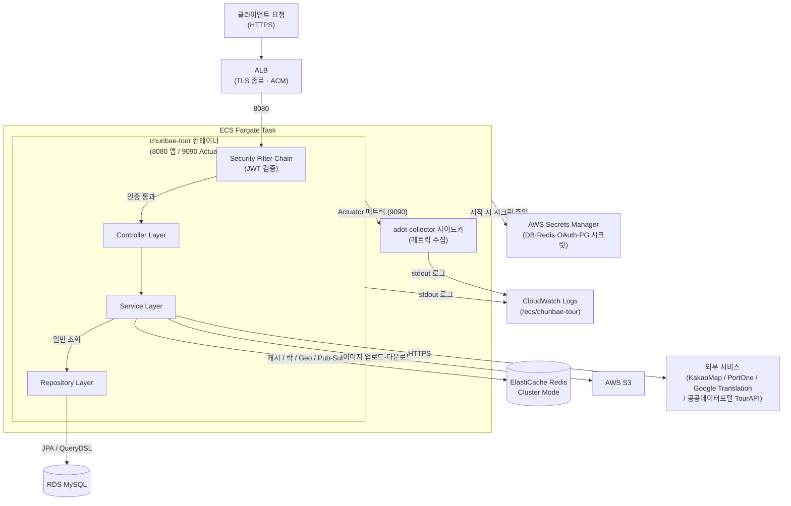
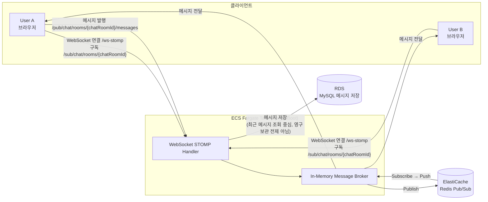

# 07_인프라_아키텍처_다이어그램

<!-- latest-update-2026-06 -->

> **문서 버전**: v3.0  
> **최신 반영일**: 2026-06-22  
> **최종 운영 구조**: GitHub Actions → ECR → ECS Fargate → ALB → RDS/ElastiCache/S3

## 0. 최종 인프라 반영 사항

기존 초기 설계는 EC2 Docker 배포를 중심으로 작성되었으나, 최종 운영 구조는 ECS Fargate 기반으로 전환되었다. 따라서 본 문서에서는 아래 최신 구조를 우선 기준으로 본다.



### 배포 흐름



| 구성 요소 | 최종 역할 |
| --- | --- |
| GitHub Actions | 테스트 게이트, Docker 이미지 빌드, ECR push, ECS 배포 자동화 |
| ECR | 백엔드 Docker 이미지 저장소 |
| ECS Fargate | Spring Boot 컨테이너 실행, 서버 직접 관리 제거 |
| ALB | HTTPS 트래픽 수신, target health 기반 라우팅 |
| RDS MySQL | 영속 데이터 저장, Flyway migration 대상 |
| ElastiCache Redis Cluster | 캐시, 랭킹, 최근 검색어, Geo, Pub/Sub, 분산 락, write-behind counter |
| S3 | 프로필/게시글/채팅/CS/가게 이미지 및 첨부 저장 |
| Secrets Manager | DB, Redis, OAuth, JWT, 외부 API secret 관리 |
| CloudWatch | 애플리케이션 로그, 배포 장애 추적 |
| Actuator/Micrometer/ADOT | health check와 metric 수집 |

### Redis Cluster 운영 메모

ElastiCache Redis는 Cluster Mode Enabled 기준이다. 따라서 `RENAME`, `MGET` 같은 multi-key 명령은 같은 hash slot의 key에서만 안전하다. 인기 검색어 스냅샷/오타 교정/추천 캐시는 hash tag로 key slot을 맞추고, 관광지 통계처럼 key 수가 많은 경우에는 hot slot을 만들지 않도록 개별 GET/pipeline 전략을 사용한다.

---


> **문서 버전**: v1.0
**작성일**: 2026-05-15
**프로젝트명**: 춘배투어 (ChunBae Tour)
**작성자**: 황춘배
> 

---

## 1. 전체 인프라 구성 개요

| 구성 요소 | 서비스 | 사양 | 역할 |
| --- | --- | --- | --- |
| **애플리케이션 서버** | AWS EC2 | t3.medium | Spring Boot 앱 실행 (Docker) |
| **데이터베이스** | AWS RDS MySQL | db.t3.micro | 메인 데이터 저장소 (AWS RDS 접근 포트: 3306) |
| **캐시 / 메시징** | AWS ElastiCache Redis | cache.t3.micro | 캐시, 분산 락, Pub/Sub, Geospatial |
| **컨테이너 레지스트리** | AWS ECR | - | Docker 이미지 저장소 |
| **CI/CD** | GitHub Actions | - | 빌드 → ECR Push → EC2 배포 |
| **프론트엔드** | React PWA | - | 바이브코딩 (정적 파일 서빙 or S3) |
| **외부 연동** | KakaoMap API / PG사 / Google Cloud Translation API / Tour API(추후 확장) | - | 외부 서비스 연동 |

---

## 2. 전체 인프라 아키텍처 다이어그램

> ECS Fargate 기반 최종 운영 구조 (EC2 구조에서 전환됨)



---

## 3. CI/CD 파이프라인 상세

> ECS Fargate 롤링 배포 기준 (SSH 없음)



---

## 4. 네트워크 보안 구성 (Security Group)

> SSH 포트(22) 없음 — 배포는 GitHub Actions OIDC → AWS API 경유(SSH 키 불필요)



### Security Group 규칙 상세

**SG-ALB (로드밸런서)**

| 방향 | 프로토콜 | 포트 | 소스 | 설명 |
| --- | --- | --- | --- | --- |
| Inbound | TCP | 80 | 0.0.0.0/0 | HTTP → HTTPS 리다이렉트 |
| Inbound | TCP | 443 | 0.0.0.0/0 | HTTPS (ACM 인증서) |
| Outbound | TCP | 8080 | SG-TASK | 앱 트래픽 전달 |

**SG-TASK (ECS Fargate 태스크)**

| 방향 | 프로토콜 | 포트 | 소스 | 설명 |
| --- | --- | --- | --- | --- |
| Inbound | TCP | 8080 | SG-ALB | ALB에서만 앱 요청 수신 |
| Outbound | ALL | ALL | 0.0.0.0/0 | 외부 API / ECR / Secrets Manager 호출 |

> 포트 9090(Actuator 관리 포트)은 태스크 내부 헬스체크(`wget localhost:9090/actuator/health`)만 사용 — 외부 미노출

**SG-RDS (데이터베이스)**

| 방향 | 프로토콜 | 포트 | 소스 | 설명 |
| --- | --- | --- | --- | --- |
| Inbound | TCP | 3306 | SG-TASK | ECS 태스크에서만 접근 허용 |

**SG-Redis (ElastiCache)**

| 방향 | 프로토콜 | 포트 | 소스 | 설명 |
| --- | --- | --- | --- | --- |
| Inbound | TCP | 6379 | SG-TASK | ECS 태스크에서만 접근 허용 |

---

## 5. 애플리케이션 내부 요청 처리 흐름

> Nginx 없음 — ALB가 TLS 종료, 태스크에 8080 직접 전달. 컨테이너 2개(앱 + ADOT 사이드카).



---

## 6. WebSocket 실시간 채팅 흐름



> 고객센터 실시간 상담 채팅도 동일한 WebSocket/STOMP 인프라를 사용하되, STOMP 경로는 `/pub/support/rooms/{supportRoomId}/messages`, `/sub/support/rooms/{supportRoomId}`로 분리한다.
> 

> **💡 Redis Pub/Sub을 쓰는 이유**
ECS 태스크가 여러 개로 수평 확장될 경우, 태스크 A에 연결된 User A가 보낸 메시지를
태스크 B에 연결된 User B도 받을 수 있도록 Redis가 브로커 역할을 한다.
현재 단일 태스크 운영 중이지만 확장을 고려한 구조로 설계됨.
> 

---

## 7. 환경 분리 전략

| 환경 | 트리거 | 배포 대상 | DB | 프로파일 |
| --- | --- | --- | --- | --- |
| **local** | 로컬 실행 | Docker Compose (MySQL+Redis만) | 로컬 MySQL 8.4 (포트 3308) | `local` |
| **prod** | main 브랜치 push | ECS Fargate (롤링 배포) | AWS RDS MySQL (Multi-AZ) | `prod` |

- CI (`ci.yml`): `feature/*` PR → develop, develop push → 컴파일 게이트 + Testcontainers 테스트
- CD (`cd.yml`): main push → 테스트 재게이트 → ECR push(commit SHA) → ECS rolling 배포

> 로컬 MySQL은 호스트 3308(컨테이너 내부 3306), Redis는 호스트 6380(컨테이너 내부 6379) 포트 매핑 사용.
> `.env.example` → `.env` 복사 후 `scripts/dev-up.sh` (또는 `dev-up.ps1`) 실행.

### Docker Compose (로컬 개발 환경)

```yaml
# docker-compose.yml (로컬 개발용 — MySQL+Redis만, 앱은 IDE에서 직접 실행)
services:
  mysql:
    image: mysql:8.4
    container_name: chunbae-tour-mysql
    environment:
      MYSQL_ROOT_PASSWORD: ${DB_PASSWORD:-1234}
      MYSQL_DATABASE: ${DB_NAME:-chunbae_tour}
      MYSQL_USER: ${DB_USERNAME:-chunbae}
      MYSQL_PASSWORD: ${DB_PASSWORD:-1234}
    ports:
      - "${DB_PORT:-3308}:3306"   # 호스트 3308 → 컨테이너 3306
    volumes:
      - chunbae-mysql-data:/var/lib/mysql

  redis:
    image: redis:7-alpine
    container_name: chunbae-tour-redis
    ports:
      - "${REDIS_PORT:-6380}:6379"  # 호스트 6380 → 컨테이너 6379
    volumes:
      - chunbae-redis-data:/data

volumes:
  chunbae-mysql-data:
  chunbae-redis-data:
```

---

## 8. 인프라 비용 추정 (월 기준)

| 서비스 | 사양 | 예상 비용 |
| --- | --- | --- |
| ECS Fargate (태스크 1개 상시) | 1 vCPU · 2GB RAM | ~$41/월 |
| ALB | LCU 기준 | ~$18/월 |
| RDS MySQL (Multi-AZ) | db.t3.micro | ~$30/월 |
| ElastiCache Redis (Cluster) | cache.t3.micro | ~$20/월 |
| ECR | 이미지 스토리지 | ~$1/월 |
| AWS Secrets Manager | ~25개 시크릿 | ~$10/월 |
| CloudWatch Logs | 로그 수집·보관 | ~$3/월 |
| S3 | 이미지 스토리지 | ~$1/월 |
| **합계** | | **~$124/월** |

> ⚠️ AWS 교육 계정 크레딧 사용 시 비용 부담 없음.
> Fargate는 태스크 실행 시간 기준 과금 — ECS 서비스 desired count=0으로 내리면 즉시 중단 가능.
> RDS·ElastiCache는 인스턴스 중지 후에도 스토리지 비용 발생.

---

*본 문서는 실제 배포 구성 변경 시 함께 업데이트한다.*
