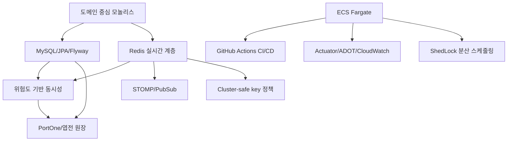

# 09_ADR

> **문서 버전**: v3.0
> **프로젝트명**: 춘배투어 (ChunBae Tour)
> **최신 반영일**: 2026-06-22
> **반영 기준**: 백엔드 `origin/develop`, 프론트엔드 구성, Flyway 스키마, AWS ECS 배포 워크플로우, 운영·보안 문서

---

## 1. 문서 목적

ADR(Architecture Decision Record)은 단순 기술 목록이 아니라, 특정 문제에 대해 어떤 대안을 검토했고 왜 현재 구조를 선택했는지 기록한다. v3에서는 초기 기획과 실제 구현이 다른 결정을 최신 코드 기준으로 바로잡는다.

### 1.1 상태 정의

| 상태 | 의미 |
| --- | --- |
| Accepted | 현재 코드와 운영에서 사용 중인 결정 |
| Superseded | 후속 결정으로 대체된 과거 결정 |
| Proposed | 필요성은 확인했지만 아직 운영 반영되지 않은 결정 |

### 1.2 최종 ADR 목록

| ADR | 제목 | 상태 |
| --- | --- | --- |
| ADR-001 | Java 21 + Spring Boot 4.0.6 | Accepted |
| ADR-002 | 도메인 중심 모듈러 모놀리스 | Accepted |
| ADR-003 | MySQL + JPA + QueryDSL + Spatial + Flyway | Accepted |
| ADR-004 | Redis를 실시간 데이터 처리 계층으로 활용 | Accepted |
| ADR-005 | 위험도 기반 동시성 전략 조합 | Accepted |
| ADR-006 | JWT + OAuth + Redis 토큰 생명주기 | Accepted |
| ADR-007 | WebSocket/STOMP + Redis Pub/Sub | Accepted |
| ADR-008 | Cursor 기반 페이지네이션 표준 | Accepted |
| ADR-009 | S3 object key 기반 파일 저장과 검증 | Accepted |
| ADR-010 | PortOne V2 + 엽전 원장 모델 | Accepted |
| ADR-011 | ShedLock JDBC 기반 분산 스케줄링 | Accepted |
| ADR-012 | ECS Fargate + ALB + ECR 운영 배포 | Accepted |
| ADR-013 | GitHub Actions OIDC·불변 이미지 CI/CD | Accepted |
| ADR-014 | Actuator/Micrometer/Prometheus/ADOT/CloudWatch 관측성 | Accepted |
| ADR-015 | 외부 API timeout·캐시·검증 기반 장애 격리 | Accepted |
| ADR-016 | PWA 기반 웹 클라이언트 | Accepted |
| ADR-017 | Redis Cluster-safe key 설계와 단계적 이관 | Accepted |
| ADR-018 | 운영 Swagger 제한과 별도 API 문서 제공 | Accepted |

---

## ADR-001. Java 21 + Spring Boot 4.0.6

### 컨텍스트

5명의 팀원이 6주 안에 인증, 지도, 검색, 채팅, 결제, 상점, 관리자까지 구현해야 했다. 생산성과 생태계, 장기 유지보수를 함께 고려해야 했다.

### 결정

- Java 21 toolchain
- Spring Boot 4.0.6
- Spring Web MVC, Security, Data JPA, WebSocket, Actuator를 같은 애플리케이션에서 사용

### 대안

| 대안 | 미선택 이유 |
| --- | --- |
| Kotlin + Spring | 팀 학습 비용과 일정 위험 |
| Node.js/NestJS | 기존 Java/Spring 자산과 테스트 기반 재구축 필요 |
| 마이크로서비스별 다른 런타임 | 팀 규모 대비 운영 복잡도가 큼 |

### 결과

- Jakarta 기반 JPA·Validation·Security를 일관되게 사용한다.
- Java 21 LTS와 record, switch expression 등을 활용한다.
- Docker runtime은 `eclipse-temurin:21-jre-alpine`, builder는 JDK 21을 사용한다.

---

## ADR-002. 도메인 중심 모듈러 모놀리스

### 컨텍스트

도메인은 20개 이상이지만 팀과 운영 인프라는 하나다. 초기부터 마이크로서비스로 분리하면 배포, 인증, 분산 트랜잭션, 관측 비용이 구현 가치보다 커진다.

### 결정

단일 Spring Boot 배포 단위 안에서 `com.chunbaetour.domain.{domain}` 기준으로 도메인을 분리한다.

```text
controller → service → repository/entity
                 ↓
          external client / storage
```

공통 응답·예외·설정·rate limit·Redis/S3 기반 기능만 `domain.common`에 둔다. 도메인 간 참조는 실제 FK와 논리 ID 참조를 요구에 따라 구분한다.

### 결과

- 단일 트랜잭션으로 결제·지갑·이력을 묶을 수 있다.
- 배포와 로컬 개발이 단순하다.
- 도메인 간 결합이 커지지 않도록 서비스와 validator 경계를 유지해야 한다.
- 향후 분리가 필요하면 외부 I/O와 논리 참조가 이미 구분된 경계를 후보로 삼는다.

---

## ADR-003. MySQL + JPA + QueryDSL + Spatial + Flyway

### 컨텍스트

회원, 주문, 신고, 정산, 채팅 참여처럼 관계와 상태 전이가 중요한 데이터가 많다. 동시에 검색 조건 조합, cursor paging, 지도 좌표 범위·거리 계산이 필요하다.

### 결정

| 영역 | 선택 |
| --- | --- |
| 영속 DB | MySQL, 운영 RDS |
| ORM | Spring Data JPA + Hibernate |
| 동적 조회 | `io.github.openfeign.querydsl` 5.6.1 Jakarta fork |
| 공간 데이터 | Hibernate Spatial, MySQL `POINT SRID 4326` |
| 스키마 변경 | Flyway, 운영 `ddl-auto=validate` |

QueryDSL은 키워드·지역·카테고리·상태·cursor 조건을 타입 안전하게 조립한다. 위치 조회는 MBR 후보 필터와 `ST_Distance_Sphere`를 조합한다.

### 대안

- 파생 메서드만 사용: 조건 조합 수가 증가하고 쿼리 의도가 분산된다.
- JPQL 문자열 직접 조합: 타입 안전성과 리팩터링 안정성이 낮다.
- 위도·경도 숫자 컬럼만 사용: 공간 인덱스와 공간 함수 활용이 제한된다.
- Hibernate ddl-auto update: 공유·운영 DB의 변경 이력과 재현성이 부족하다.

### 결과

- Flyway 적용 후 Hibernate가 schema를 검증한다.
- 이미 공유 DB에 반영된 migration은 수정하지 않고 새 migration으로 forward-fix한다.
- Spatial 좌표는 `POINT(lng lat)`, SRID 4326, `axis-order=long-lat` 계약을 지킨다.

---

## ADR-004. Redis를 실시간 데이터 처리 계층으로 활용

### 컨텍스트

관광지 상세 캐시뿐 아니라 인기 검색어, 최근 검색어, 위치 추천, 조회수·좋아요, 실시간 메시지, rate limit, 토큰 상태처럼 DB에 매 요청 접근하기 어려운 기능이 존재한다.

### 결정

Redis를 단순 cache-aside 저장소가 아니라 다음 실시간 기능의 실행 계층으로 사용한다.

| 자료구조/기능 | 사용처 |
| --- | --- |
| String/JSON | 관광지 상세, 지오코딩, 자동완성 캐시 |
| ZSet | 인기 검색어, 인기 관광지 |
| List + Lua | 최근 검색어 |
| Set | 관광지 통계 Dirty Set, 오타 교정 gram index |
| Counter + Lua | 조회수·좋아요, rate limit |
| Geo | 위치 기반 추천 인덱스 |
| Pub/Sub | 채팅, CS, 알림 fan-out |
| SET NX | 멱등성, dedup, cache lock |

로컬/CI는 Redis 7을 사용하고 운영은 TLS가 적용된 ElastiCache/Valkey endpoint를 사용한다. Spring Data Redis는 Lettuce, 분산 락은 Redisson 3.35.0을 사용한다.

### 데이터별 장애 정책

- 인기·최근 검색어: fail-open
- 캐시: 원본 DB/외부 API fallback
- Rate Limit: fail-closed
- 결제·재고·채팅 락: 정합성 우선으로 요청 실패/재시도

### 결과

Redis 데이터마다 TTL, DB source of truth 여부, 장애 정책을 별도로 문서화해야 한다. 모든 Redis 데이터가 동일한 중요도를 가진다고 가정하지 않는다.

---

## ADR-005. 위험도 기반 동시성 전략 조합

### 컨텍스트

금전 처리와 검색 카운트에 같은 락을 적용하면 과도한 직렬화 또는 정합성 부족이 발생한다. 여러 ECS task와 MySQL/Redis의 특성을 함께 고려해야 한다.

### 결정

| 위험 | 전략 |
| --- | --- |
| 재고·지갑·결제 | Redisson + DB 비관적 락 + 트랜잭션 |
| 중복 웹훅·상태 전이 | Redis 멱등키 + DB 조건부 UPDATE(CAS) |
| 충돌이 드문 편집 | JPA `@Version` |
| 최종 중복 방지 | DB UNIQUE |
| 고빈도 통계 | Redis 원자 연산 + Write-Behind |
| 분산 스케줄러 | ShedLock JDBC |

공통 분산 락 유틸 하나로 모든 흐름을 추상화하지 않는다. 각 도메인은 wait/lease/트랜잭션 경계와 장애 정책이 다르므로 명시적으로 구현한다.

### 결과

- 락은 DB 제약을 대체하지 않고 사전 직렬화 역할을 한다.
- 고정된 락 획득 순서를 문서화한다.
- 커밋 전 락 해제로 생기는 race를 막기 위해 `TransactionSynchronization`을 사용한다.
- 상세 시나리오는 `08_동시성_제어_설계서.md`를 기준으로 한다.

---

## ADR-006. JWT + OAuth + Redis 토큰 생명주기

### 컨텍스트

웹/PWA 클라이언트와 역할별 API를 stateless하게 인증하면서, 로그아웃·탈퇴·재발급 시 토큰을 즉시 무효화해야 한다. Kakao/Naver 소셜 로그인도 지원해야 한다.

### 결정

- Access Token: JWT Bearer
- Refresh Token: HttpOnly Cookie + Redis 저장
- Refresh rotation: 사용자별 현재 tokenId 교체
- Logout: Refresh 삭제 + Access tokenId blacklist
- OAuth: Kakao/Naver provider token 검증 후 가입 ticket 또는 로그인 처리
- 역할: USER, MERCHANT, ADMIN

Redis TTL과 JWT exp를 맞추며, OAuth 신규 가입은 10분 서명 ticket으로 provider identity 위조를 방지한다.

### 결과

- 서버 HTTP session은 사용하지 않는다.
- Refresh Cookie의 SameSite 정책과 배포 도메인이 보안 계약이 된다.
- Redis 장애는 재발급·로그아웃 즉시성에 영향을 주므로 운영 health 대상이다.

---

## ADR-007. WebSocket/STOMP + Redis Pub/Sub

### 컨텍스트

동행 채팅, 고객센터 상담, 사용자 알림은 양방향 또는 서버 푸시가 필요하다. ECS task가 여러 개면 연결된 task가 서로 다를 수 있다.

### 결정

- WebSocket/STOMP endpoint: `/ws-stomp`
- 클라이언트 publish/subscribe destination 분리
- DB에 메시지 저장 후 Redis Pub/Sub으로 인스턴스 간 fan-out
- 채팅, CS, 알림 채널과 실패 메트릭을 분리

### 대안

| 대안 | 판단 |
| --- | --- |
| HTTP polling | 구현은 단순하지만 지연과 불필요한 요청 증가 |
| 단일 인스턴스 SimpleBroker만 사용 | 다중 ECS task에서 연결 간 메시지 전달 불가 |
| Kafka/RabbitMQ | 내구성과 기능은 강하지만 팀 규모와 트래픽 대비 운영 비용 큼 |

### 결과

Redis Pub/Sub은 메시지 저장소가 아니므로 DB가 이력의 source of truth다. publish/serialize/broadcast 실패는 Micrometer counter로 관측한다.

---

## ADR-008. Cursor 기반 페이지네이션 표준

### 컨텍스트

게시글, 결제, 알림, 신고, 검색처럼 계속 증가하는 목록에서 큰 OFFSET은 뒤 페이지로 갈수록 비용이 커지고, 데이터 삽입 시 중복·누락이 발생할 수 있다.

### 결정

- 기본 목록은 id DESC keyset cursor를 사용한다.
- 복합 정렬은 ID와 rating/distance 같은 정렬 cursor 쌍을 사용한다.
- `size + 1` 조회로 `hasNext`를 판단한다.
- cursor는 URL-safe Base64로 인코딩하고 `CursorPageResponse`로 응답을 통일한다.
- 관리자/일부 마이페이지처럼 페이지 번호 UX가 필요한 기능만 offset `Page`를 허용한다.

### 결과

프론트는 `nextCursor`를 해석하지 않고 그대로 다음 요청에 전달한다. 정렬 기준이 바뀌면 cursor 계약도 함께 버전 관리해야 한다.

---

## ADR-009. S3 object key 기반 파일 저장과 검증

### 컨텍스트

ECS 컨테이너 로컬 파일시스템은 영속 저장소가 아니며, 프로필·게시글·채팅·CS·가게 이미지를 여러 task가 공유해야 한다. 사용자 파일은 확장자와 Content-Type만 신뢰할 수 없다.

### 결정

- AWS S3에 파일 저장
- DB에는 장기 presigned URL이 아니라 object key 저장
- 응답 시 접근 URL 생성
- Apache Tika로 magic byte/MIME 검증
- HWP v5는 Apache POI POIFS로 실제 `FileHeader` 확인
- 이미지 5MB, 문서 10MB 등 도메인별 크기 제한
- DB commit/rollback과 S3 객체 삭제·복구 시점을 TransactionSynchronization으로 조정
- orphan cleanup scheduler 운영

### 결과

ECS task role의 `DefaultCredentialsProvider`를 사용해 액세스 키 하드코딩을 피한다. S3와 DB는 하나의 트랜잭션이 아니므로 보상 처리와 orphan 감시가 필요하다.

---

## ADR-010. PortOne V2 + 엽전 원장 모델

### 컨텍스트

외부 결제 완료와 내부 엽전 충전, QR 결제, 환불이 연결된다. 웹훅 중복·유실·지연과 외부 상태 불일치를 복구해야 한다.

### 결정

- PortOne 사전등록 후 프론트 결제창 실행
- Standard Webhooks 서명 검증과 webhook-id 멱등성
- PaymentOrder와 Refund 상태 머신
- 사용자 Wallet/가게 ShopWallet과 `yeopjeon_histories` 원장 기록
- DB CAS로 웹훅 중복 전이 차단
- PENDING 재조정과 환불 지수 백오프 scheduler
- 부분 취소·잔액 부족 회수는 `ADJUSTMENT_REQUIRED/REQUIRES_ADMIN`으로 운영 이관

### 결과

PG 응답만 믿지 않고 결제 ID·금액·상태를 서버에서 재검증한다. 외부 호출 실패는 재시도하되 금전 상태가 불확실하면 자동 추측보다 관리자 확인을 선택한다.

---

## ADR-011. ShedLock JDBC 기반 분산 스케줄링

### 컨텍스트

ECS task가 여러 개면 각 task의 `@Scheduled`가 모두 실행된다. 환불·만료·통계·데이터 수집이 중복 실행되면 외부 호출과 상태 전이가 겹친다.

### 결정

- ShedLock 7.7.0
- JDBC Template provider와 `shedlock` 테이블 사용
- 작업별 `lockAtMostFor`, `lockAtLeastFor` 설정
- batch 내부 상태 전이도 멱등하게 구현

### 대안

- Redis scheduler lock: 이미 Redis 의존 기능이 많아 스케줄러 락까지 같은 장애 도메인에 두지 않는다.
- 단일 task에서만 scheduler 활성화: 배포 topology와 애플리케이션 설정이 강하게 결합된다.

### 결과

DB가 스케줄 락의 source of truth다. `lockAtMostFor`는 batch size와 외부 API timeout의 최악 실행 시간보다 길게 설정해야 한다.

---

## ADR-012. ECS Fargate + ALB + ECR 운영 배포

### 컨텍스트

기존 EC2 SSH 재시작 배포는 서버 관리, 프로세스 복구, 무중단 배포, 권한 관리 부담이 컸다.

### 결정

- Docker multi-stage image
- Amazon ECR private immutable repository
- ECS Fargate Service rolling deployment
- ALB HTTPS routing과 `/actuator/health/lb` health check
- RDS, ElastiCache/Valkey, S3, Secrets Manager 연동
- non-root runtime, Java 21 JRE Alpine
- SIGTERM graceful shutdown, actuator 9090 분리

### 결과

- main merge가 실서비스 배포를 트리거한다.
- ECS circuit breaker/서비스 안정화가 실패 배포를 차단한다.
- 컨테이너는 stateless하게 유지하고 영속 데이터는 관리형 서비스에 둔다.
- v2의 EC2 직접 배포 ADR은 본 결정으로 대체된다.

---

## ADR-013. GitHub Actions OIDC·불변 이미지 CI/CD

### 컨텍스트

장기 AWS Access Key를 GitHub Secret에 저장하지 않고, 동일 커밋을 재실행해도 이미지 태그 충돌 없이 멱등하게 배포해야 한다.

### 결정

| 단계 | 정책 |
| --- | --- |
| CI build | `./gradlew build -x test` + `compileTestJava` |
| CI test | Testcontainers 기반 `./gradlew test` |
| AWS 인증 | GitHub OIDC로 단기 role credential 획득 |
| 이미지 태그 | commit SHA, ECR immutable |
| 재실행 | 동일 SHA 이미지가 있으면 build/push 생략 |
| 배포 | task definition에 SHA image 주입 후 ECS service update |

### 결과

가변 `latest`를 사용하지 않아 실행 코드의 commit 추적이 가능하다. CD에서도 테스트를 다시 실행하며 ECS 안정화까지 기다린다.

---

## ADR-014. Actuator/Micrometer/Prometheus/ADOT/CloudWatch 관측성

### 컨텍스트

분산 락, Redis, 외부 API, WebSocket, 배치 실패는 사용자 응답만으로 발견하기 어렵다. 운영에서 원인을 구분할 메트릭과 로그가 필요하다.

### 결정

- Spring Actuator health/info/prometheus
- Micrometer Prometheus registry
- JWT 검증 시간/실패, 로그인·회원가입, Rate Limit, Pub/Sub 실패, Place 통계 배치 실패 등 도메인 메트릭
- logstash JSON encoder 기반 구조화 보안 감사 로그
- ADOT sidecar/collector와 CloudWatch 연동
- 관리 포트 9090 분리, Prometheus endpoint IP 제한, 나머지 actuator deny

### 결과

메트릭 이름과 tag는 `docs/operations/metrics-catalog.md`와 동기화한다. 고카디널리티 사용자 ID·키워드는 metric tag로 사용하지 않는다.

---

## ADR-015. 외부 API timeout·캐시·검증 기반 장애 격리

### 컨텍스트

Kakao Local, Tour API, 공공데이터, PortOne, Google Translation은 네트워크 지연과 장애가 발생할 수 있다. 외부 호출이 DB 트랜잭션과 서버 스레드를 오래 점유하면 장애가 확산된다.

### 결정

- connect/read timeout을 client별로 설정
- 지오코딩/리버스 지오코딩/자동완성은 Redis 캐시 사용
- 검색 제안 Kakao 호출은 짧은 timeout과 fallback 결과 병합
- 결제는 외부 응답과 내부 주문 금액·ID를 재검증
- 외부 데이터 수집은 분산 락과 batch/upsert 사용
- 외부 호출은 가능한 DB 트랜잭션 밖에서 수행

### 결과

모든 외부 API에 동일한 circuit breaker를 일괄 적용하지 않는다. 조회성 부가 기능은 fallback, 금전 기능은 실패/재조정, 데이터 수집은 재실행 정책을 사용한다.

---

## ADR-016. PWA 기반 웹 클라이언트

### 컨텍스트

외국인 관광객이 앱스토어 설치 없이 접근하고, GPS·QR·실시간 채팅을 사용할 수 있어야 한다. 네이티브 앱을 병행할 인력은 없다.

### 결정

- React 19 + Vite 8
- PWA
- Browser Geolocation, QR scan UI, STOMP client
- pnpm, ESLint, Playwright

### 결과

하나의 웹 코드베이스로 데스크톱과 모바일을 지원한다. 브라우저 권한·iOS PWA 제약·WebSocket 재연결은 지속 검증 대상이다.

---

## ADR-017. Redis Cluster-safe key 설계와 단계적 이관

### 컨텍스트

Redis Cluster에서는 `RENAME`, Lua multi-key, MGET 등 여러 key를 다루는 명령이 같은 hash slot에 있어야 한다. 반면 모든 장소 counter를 하나의 hash tag에 모으면 hot slot이 생길 수 있다.

### 결정

- 함께 `RENAME`하는 임시/이전 key에는 동일 hash tag 적용
- 전일 랭킹 새 key 도입 시 legacy key read fallback 유지
- 장소별 counter 대량 조회는 MGET 대신 단일 GET 반복으로 slot 독립성 확보
- 사용자 입력 gram을 hash tag로 직접 사용하지 않도록 key 구성 검증
- 현재 Redisson 운영 연결은 `useSingleServer()` 단일 샤드 기준 유지

### 결과

현재 런타임 연결 방식과 cluster-safe key 설계를 구분한다. Cluster Mode Enabled 전환은 `useClusterServers()`, SCAN 노드 범위, Lua key slot, hot slot을 포함한 별도 마이그레이션으로 수행해야 한다.

---

## ADR-018. 운영 Swagger 제한과 별도 API 문서 제공

### 컨텍스트

개발 중 Swagger는 유용하지만 운영 관리·내부 API까지 무제한 노출하는 것은 바람직하지 않다. 프론트/QA에는 배포와 독립된 안정적인 API 명세가 필요하다.

### 결정

- 코드의 Springdoc annotation을 API 계약의 입력으로 사용
- 팀 공유 API 문서는 별도 정적 사이트로 제공
- 문서 주소: `https://chunbae-tour-api.netlify.app/`
- 운영 actuator는 health/info만 공개하고 prometheus는 제한, 기타 endpoint는 차단

### 결과

코드 변경 시 annotation과 정적 API 문서를 함께 갱신해야 한다. 공개 문서와 실제 컨트롤러 간 drift를 QA 체크리스트로 확인한다.

---

## 2. 결정 간 연결 관계



---

## 3. 구현과 문서의 우선순위

충돌 시 다음 순서로 사실을 확인한다.

1. `origin/develop` 실제 코드와 Flyway migration
2. 운영 `application-prod.yml`, ECS task definition, GitHub Actions workflow
3. v3 SA 문서
4. v2/v1 초기 설계 문서

v1/v2의 구현 예시를 신규 코드의 근거로 복사하지 않는다. 특히 EC2 직접 배포, 모든 기능의 공통 Redisson fallback, Redis Cluster Mode 단정처럼 후속 구현과 달라진 항목은 v3 결정을 우선한다.

---

## 4. 후속 검토 목록

| 항목 | 현재 상태 | 검토 조건 |
| --- | --- | --- |
| Redis Cluster Mode Enabled | Proposed | 트래픽/용량 증가, 다중 샤드 필요 시 |
| Kafka/RabbitMQ | 미도입 | 메시지 내구성·재처리 요구 증가 시 |
| Circuit Breaker 표준화 | 부분 적용 | 외부 API 장애 지표와 fan-out 증가 시 |
| 서비스 분리 | 미도입 | 독립 배포·조직 경계 필요 시 |
| Rate Limit token bucket | 미도입 | fixed window 경계 burst가 정책상 문제될 때 |
| Outbox pattern | 미도입 | DB commit과 알림/PubSub의 전달 보장이 강화될 때 |
